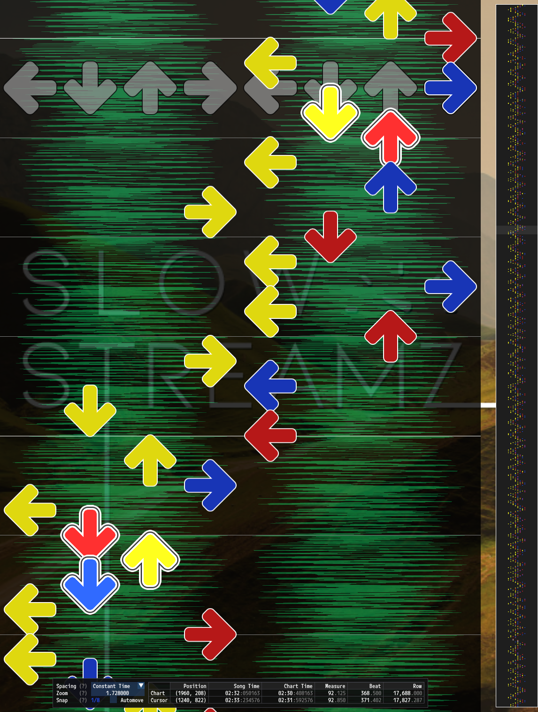
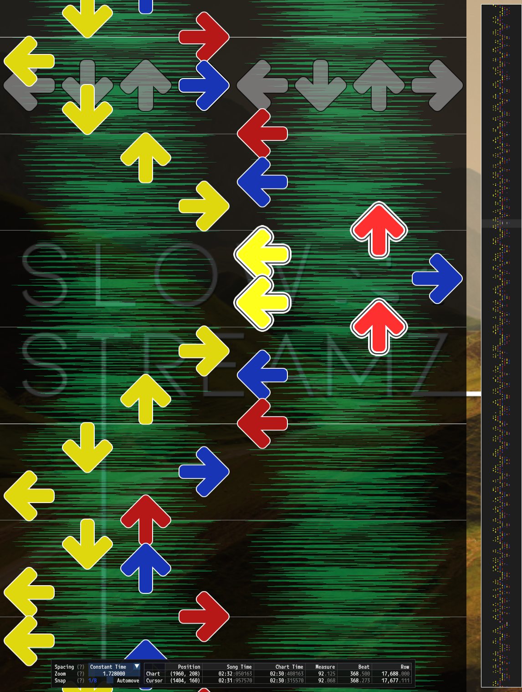
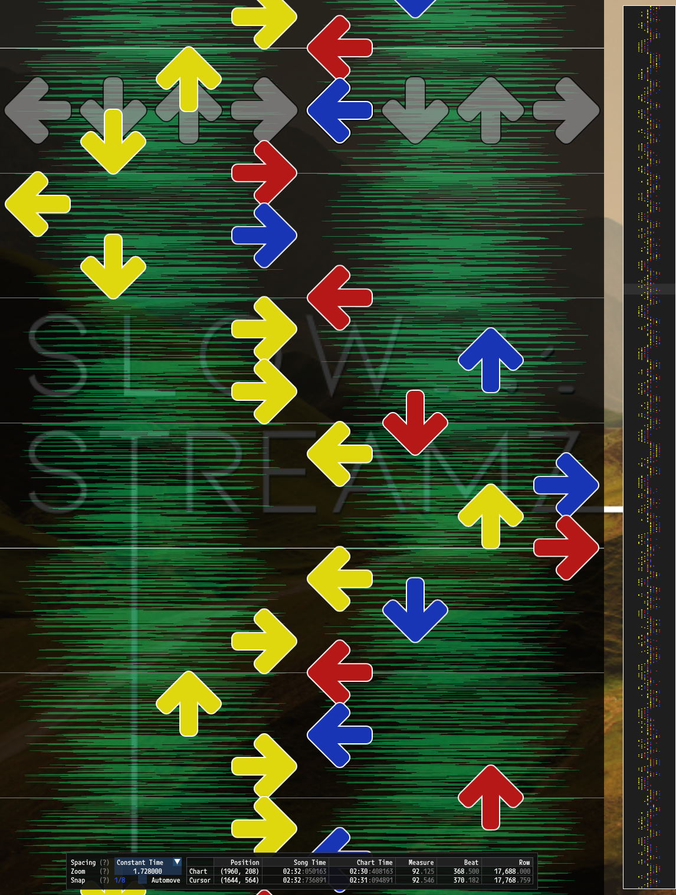

# Facing Controls

Facing controls are a part of [PerformedChart Configuration](PerformedChart.md#performedchart-configuration) that allow for limiting steps which face the body inward or outward.

<table>
<tr>
<th width="33%"> No Limit </th>
<th width="33%"> Limit Inward Steps on Outer Thirds</th>
<th width="33%"> Limit Inward Steps on Outer Halves</th>
</tr>
<tr>
<td>

[](facing-limit-none.png)

</td>
<td>

[](facing-limit-outer-third.png)

</td>

<td>

[](facing-limit-outer-half.png)

</td>

</tr>
</table>

*Example limitations to inward facing orientations in a stamina chart that allows candles.* 

## Example Configuration

```json5
"Facing":
{
	// Penalize all inward facing steps.
	"MaxInwardPercentage": 0.0,
	// Penalize inward steps on the outer third of the pads.
	"InwardPercentageCutoff": 0.33,
	// Do not penalize outward facing steps.
	"MaxOutwardPercentage": 1.0,
	"OutwardPercentageCutoff": 0.5,
},
```

## Controls

### `MaxInwardPercentage`

Number (double) type. Maximum desired percentage of steps which face inward.

### `InwardPercentageCutoff`

Number (double) type. Cutoff percentage to use for determining how far to the side of the pads both feet must be in order to be considered for inward facing checks. For example `0.5` means both feet must be on the same half of the pads and `0.33` means both feet must be on the same outer third of the pads.

### `MaxOutwardPercentage`

Number (double) type. Maximum desired percentage of steps which face outward.

### `OutwardPercentageCutoff`

Number (double) type. Cutoff percentage to use for determining how far to the side of the pads both feet must be in order to be considered for outward facing checks. For example `0.5` means both feet must be on the same half of the pads and `0.33` means both feet must be on the same outer third of the pads.

## `dance-double` Cutoff Example

```
Inward facing step on outer third.                 Inward facing step on outer third.
                | 1/3 cutoff                                       | 1/3 cutoff                    
         _______|                _______                    _______|                _______        
        |       |               |       |                  |       |               |       |       
        |   L   |               |       |                  |       |               |       |       
 _______|_______|_______ _______|_______|_______    _______|_______|_______ _______|_______|_______
|       |       |       |       |       |       |  |       |       |       |       |       |       |
|       |       |       |       |       |       |  |   L   |       |       |       |       |       |
|_______|_______|_______|_______|_______|_______|  |_______|_______|_______|_______|_______|_______|
        |       |               |       |                  |       |               |       |       
        |   R   |               |       |                  |   R   |               |       |       
        |_______|               |_______|                  |_______|               |_______|       
                |                                                  |                               
```
