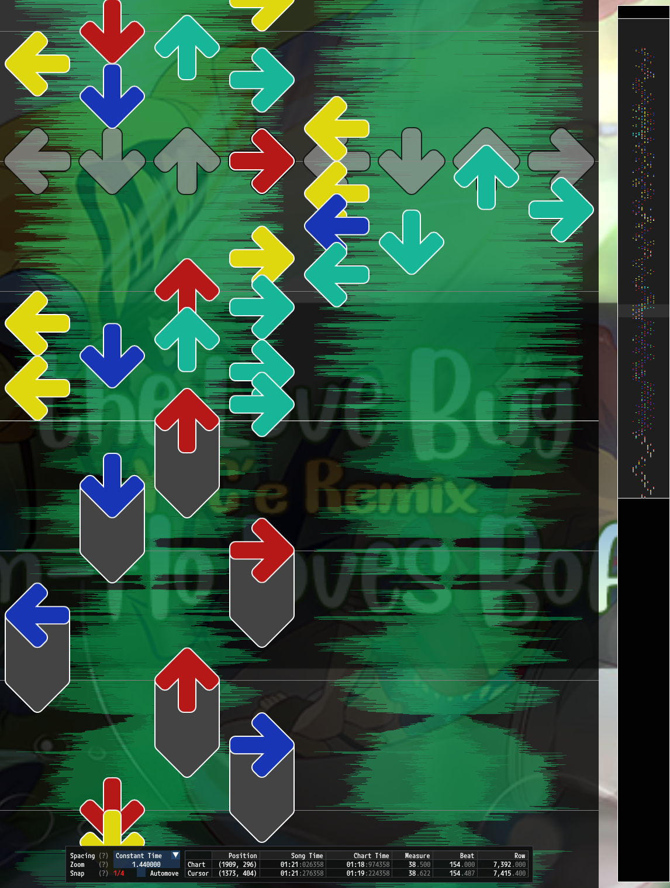
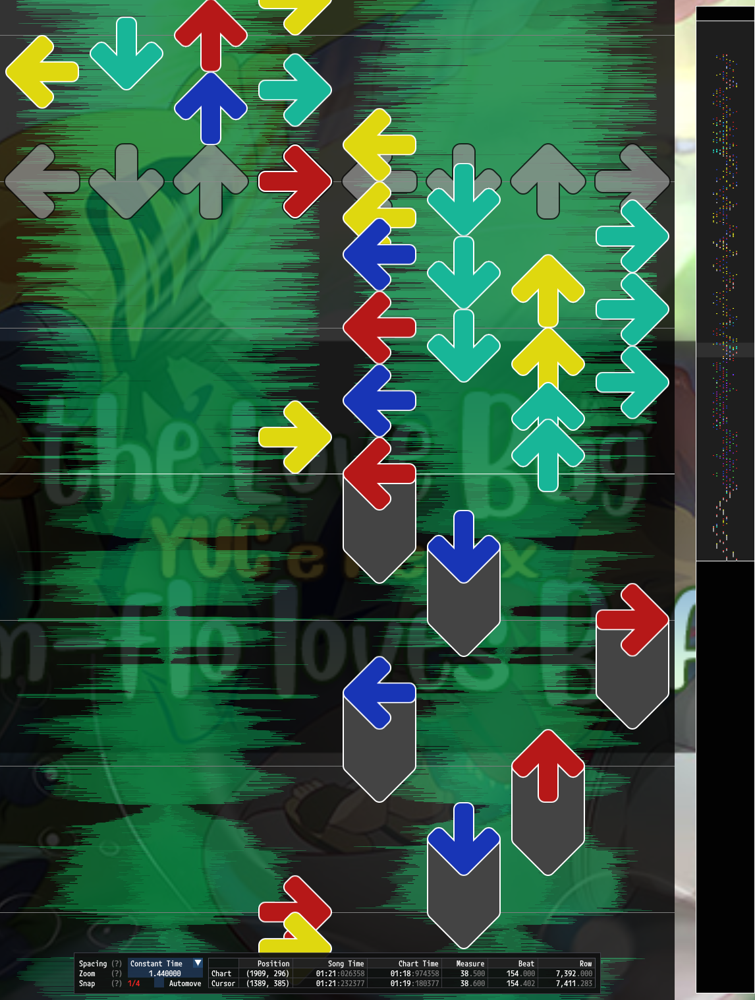

# Lateral Tightening Controls

Lateral tightening controls are a part of [PerformedChart Configuration](PerformedChart.md#performedchart-configuration) that allow for limiting lateral movement for high notes-per-second steps.

<table width="66%">
<tr>
<th width="50%"> No Lateral Tightening </th>
<th width="50%"> Lateral Tightening</th>
</tr>
<tr>
<td>

[](ateral-tightening-off.png)

</td>
<td>

[](lateral-tightening-on.png)

</td>

</tr>
</table>

*Example of lateral tightening controls restricting high notes-per-second movement.* 

## Example Configuration

```json5
"LateralTightening":
{
	// Enable lateral tightening.
	"Enabled": true,
	// Penalize lateral movement steps that are 1.65 times as dense as the chart average.
	"RelativeNPS": 1.65,
	// Penalize lateral movement steps that are over 12 notes per second.
	"AbsoluteNPS": 12.0,
	// The body must be moving at least 3 arrow widths per second for lateral tightening to penalize steps.
	"Speed": 3.0,
},
```

## Explanation

Lateral tightening controls offer a method for restricting fast lateral movement across the pads. Lateral movement is side-to-side movement in the X dimension. Lateral tightening rules consider patterns that move the body in one lateral direction. This includes steps which do not change the lateral direction. For example, steps which move left and keep the body stationary are both valid for a section to be considered all moving in the left direction.

For steps to accue costs they must move the body over a defined `Speed` in arrow widths per second. If the body is moving over this speed, then two checks are made to see if costs should be applied. If either check passes the cost is applied.
1. If the notes per second of the steps is over `RelativeNPS` times greater than the chart's average notes per second value then a cost will be applied.
2. If the notes per second is over an absolute `AbsoluteNPS` value then a cost will be applied.

Lateral tightening costs scale with the speed of the movement, so faster segments cost more.

## Controls

### `Enabled`

Boolean type. Whether or not the lateral tightening control rules should be used.

### `RelativeNPS`

Number (double) type. Multiplier. If the notes per second of a section of steps is over the chart's average notes per second multiplied by this value then the section is considered to be fast enough to apply a lateral body movement cost to.

### `AbsoluteNPS`

Number (double) type. Absolute notes per second value. If the notes per second of a section of steps is over this value then the section is considered to be fast enough to apply a lateral body movement cost to.

### `Speed`

Number (double) type. Body speed in arrows per second over which fast sections will accrue costs.
