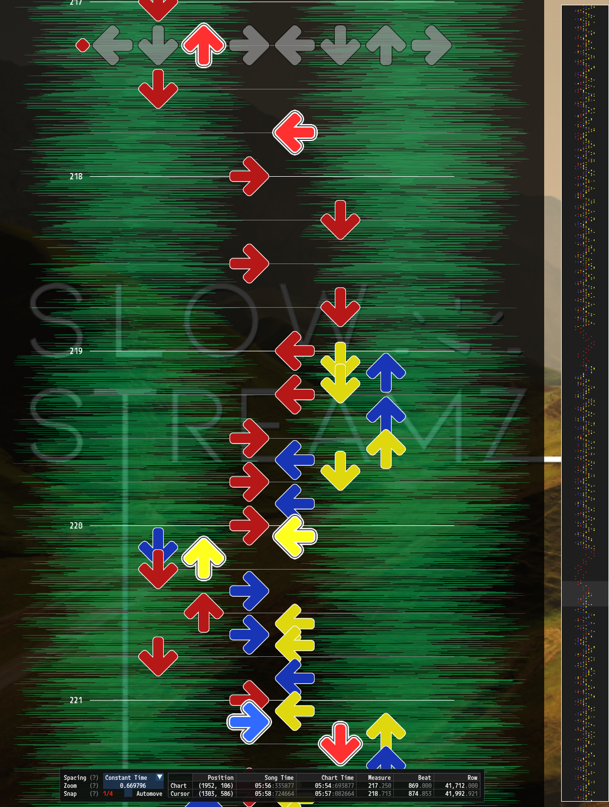
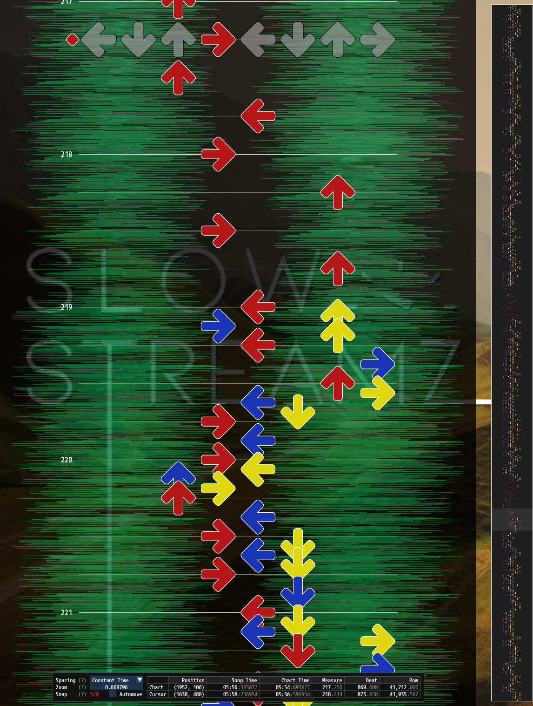
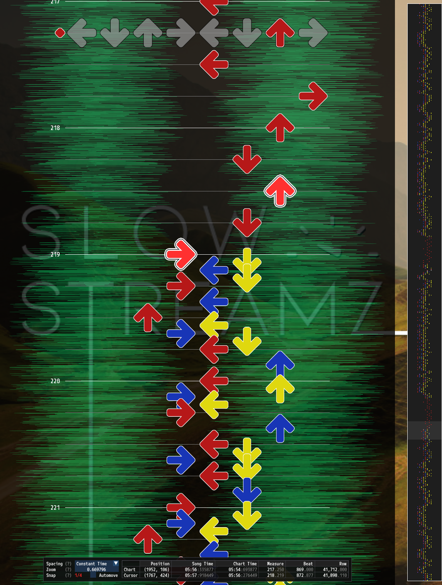
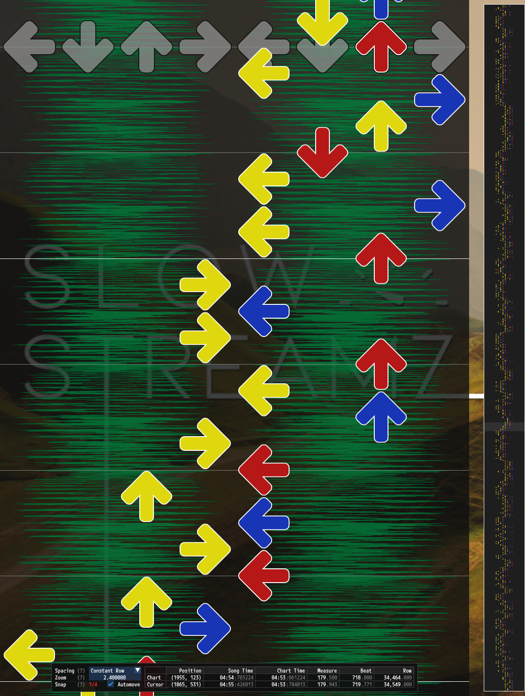
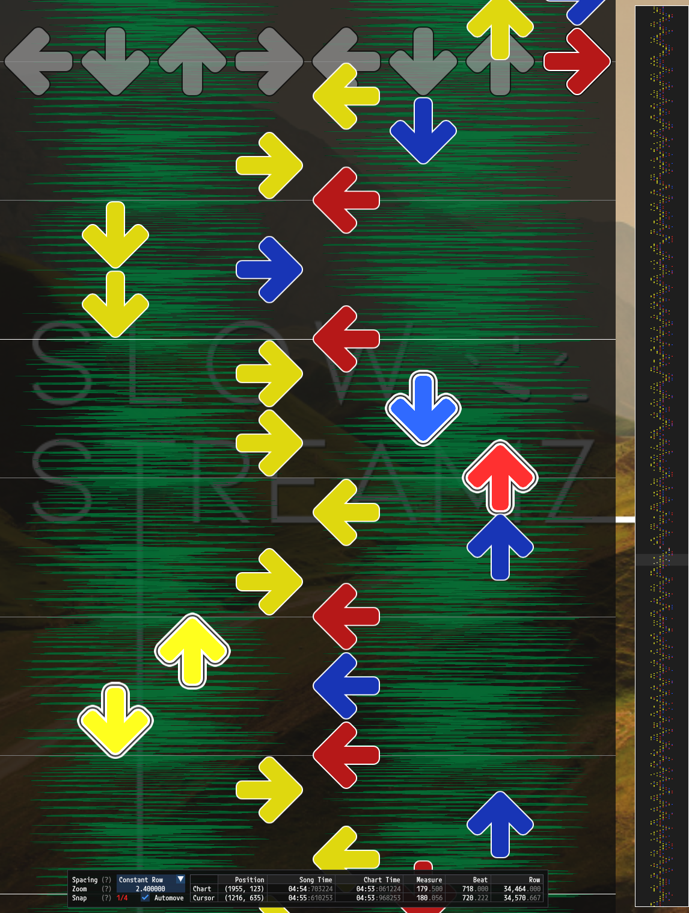
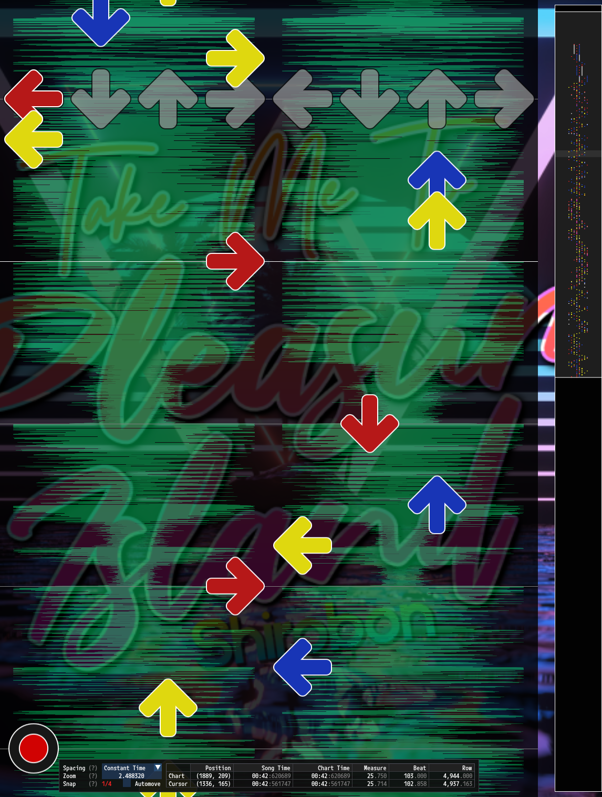
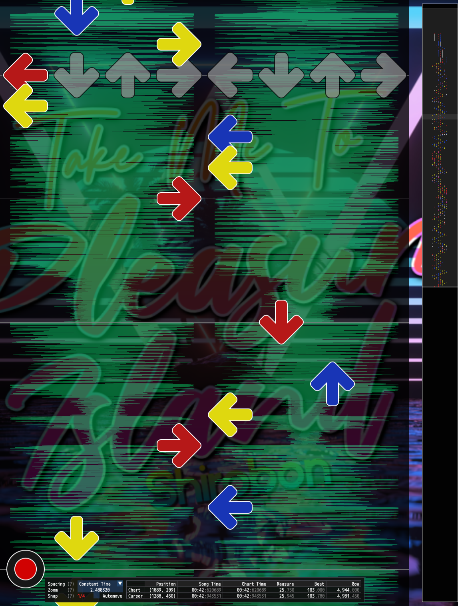

# Step Tightening Controls

Step tightening controls are a part of [PerformedChart Configuration](PerformedChart.md#performedchart-configuration) that allow for limiting individual step movements. Step tightening allows for:
- [Distance Tightening](#distance-tightening)
- [Speed Tightening](#speed-tightening)
- [Stretch Tightening](#stretch-tightening)

## Example Configuration

```json5
"StepTightening":
{
	// Laterally, consider a foot moving 1/6 into a panel as the minimum distance to trigger it.
	"LateralMinPanelDistance": 0.166667,
	// Longitudinally, consider a foot moving 1/8 outside of a panel as the minimum distance to trigger it.
	"LongitudinalMinPanelDistance": -0.125,
	
	// Enable distance tightening.
	"DistanceTighteningEnabled": true,
	// With the above min panel distance values, 1.4 will:
	// - Allow a 2X1Y move.
	// - Penalize a 2X2Y move.
	// - Penalize a 3X move.
	// - Penalize a bracket move moving an average of 2 panels.
	"DistanceMin": 1.4,
	// 2 1/3 is the cutoff for 3 panel stretch in X.
	"DistanceMax": 2.333333,

	// Enable speed tightening.
	"SpeedTighteningEnabled": true,
	// Stop increasing costs at 16th notes at 170bpm.
	"SpeedMinTimeSeconds": 0.176471,
	// Start limiting at 16th notes at 125bpm.
	"SpeedMaxTimeSeconds": 0.24,
	// Do not use a distance cutoff for speed tightening.
	"SpeedTighteningMinDistance": 0.0,

	// Enable stretch tightening.
	"StretchTighteningEnabled": true,
	// Start limiting stretch moves at 2 1/3, which is a 3 panel move in X.
	"StretchDistanceMin": 2.333333,
	// Stop increasing costs for stretch moves at 3 1/3 which is a 4 panel move in X.
	"StretchDistanceMax": 3.333333,
},
```

# Minimum Panel Distances

```json5
// Laterally, consider a foot moving 1/6 into a panel as the minimum distance to trigger it.
"LongitudinalMinPanelDistance": 0.166667,
// Longitudinally, consider a foot moving 1/8 outside of a panel as the minimum distance to trigger it.
"LongitudinalMinPanelDistance": -0.125,
```

All step tightening checks involve measuring distances in panel lengths that the feet move to satisfy steps. These movements in practice are often much less than the full distance between the centers of the panels being stepped on. These configuration values allow for more accurate distance measurements.

## Explanation

`LateralMinPanelDistance` and `LongitudinalMinPanelDistance` define the distances inward from the edges of a panel that a foot actually moves to in order to trigger the panel.

When moving laterally (side to side) the foot often only moves slightly over the panel to trigger it. This distance is `LateralMinPanelDistance`.

When moving longitudinally (forwards and backwards), the foot often moves so little that it isn't even centered over the panel being triggered. Consider hitting the up arrow in `dance-single`. The foot is usually centered over the center panel, which results is a *negative* distance as measured from the edge of the up arrow towards its center. This distance is described by `LongitudinalMinPanelDistance`.

When configuring these values it is important to use practical real-world values so that relative distances are accurate. The step tightening rules below often penalize movements proportional to how much the foot needs to move or how quickly it needs to move. When paths involve many movements with lots of costs, the relative values need to be accurate for the most desirable overall path to be chosen.

## Configuration

### `LateralMinPanelDistance`

Number (double) type. Distance in panel lengths measured inward from the edge of a panel that a foot needs to travel in order to trigger the panel when moving laterally (side-to-side).

### `LongitudinalMinPanelDistance`

Number (double) type. Distance in panel lengths measured inward from the edge of a panel that a foot needs to travel in order to trigger the panel when moving longitudinally (forwards and backwards). Often negative.

# Distance Tightening

<table width="66%">
<tr>
<th width="50%"> Without Distance or Speed Tightening </th>
<th width="50%"> With Distance Tightening </th>
</tr>
<tr>
<td>

[](no-distance-or-speed-tightening.png)

</td>
<td>

[](distance-tightening.png)

</td>

</tr>
</table>

*Example conversion of a dance-single chart to a dance-double chart without distance tightening and with distance tightening. Note that both the slow and fast sections are tightened.*

```json5
// Enable distance tightening.
"DistanceTighteningEnabled": true,
// With the above min panel distance values, 1.4 will:
// - Allow a 2X1Y move.
// - Penalize a 2X2Y move.
// - Penalize a 3X move.
// - Penalize a bracket move moving an average of 2 panels.
"DistanceMin": 1.4,
// 2 1/3 is the cutoff for 3 panel stretch in X.
"DistanceMax": 2.333333,
```

Distance tightening limits individual step movements which move large distances, regardless of speed. Distance limits are defined as a range, over which costs increase.

## Configuration

### `DistanceTighteningEnabled`

Boolean type. Whether or not the distance tightening rules should be used.

### `DistanceMin`

Number (double) type. Start of the distance range for applying costs to individual steps. Any step with a distance greater than this value will receive a non-zero distance cost.

### `DistanceMax`

Number (double) type. End of the distance range for applying costs to individual steps. Steps with distances over this value will still receive non-zero distance costs.

# Speed Tightening

| Without Distance or Speed Tightening     | With Speed Tightening                    | No Min Distance (Penalize Candles)       | Min Distance (Allow Candles)             |
:-----------------------------------------:|:----------------------------------------:|:----------------------------------------:|:-----------------------------------------:
|  |                 |                       |                          |

<table width="100%">
<tr>
<td width = 50%>
<em>Example conversion of a dance-single chart to a dance-double chart without speed tightening and with speed tightening. Note that only the fast sections are tightened.</em>
</td>
<td width = 50%>
<em>Example conversion of a dance-single chart to a dance-double chart without a min distance for speed tightening and with a min distance. Note how adding a min distance can allow more moves like candles.</em>
</td>
</tr>
</table>

```json5
// Enable speed tightening.
"SpeedTighteningEnabled": true,
// Stop increasing costs at 16th notes at 170bpm.
"SpeedMinTimeSeconds": 0.176471,
// Start limiting at 16th notes at 125bpm.
"SpeedMaxTimeSeconds": 0.24,
// Do not use a distance cutoff for speed tightening.
"SpeedTighteningMinDistance": 0.0,
```

Speed tightening limits individual steps which move quickly. Speed limits are defined as a range, over which costs increase. Speeds are defined in panel lengths per second. As an example, to penalize steps starting at 16th notes at 125bpm and peaking at 16th notes at 170bpm set `SpeedMaxTimeSeconds` to `0.24` and `SpeedMinTimeSeconds` to `0.176471`.

```
(60 seconds per minute / (4 notes per beat x 125 beats per minute)) x 2 feet) = 0.24 seconds
(60 seconds per minute / (4 notes per beat x 170 beats per minute)) x 2 feet) = 0.176471 seconds
```

## Configuration

### `SpeedTighteningEnabled`

Boolean type. Whether or not the speed tightening rules should be used.

### `SpeedMinTimeSeconds`

Number (double) type. Start of the distance range for applying costs to individual steps. Any step with a distance greater than this value will receive a non-zero distance cost.

### `SpeedMaxTimeSeconds`

Number (double) type. End of the distance range for applying costs to individual steps. Steps with distances over this value will still receive non-zero distance costs.

### `SpeedTighteningMinDistance`

Number (double) type. Minimum distance a foot must travel to be considered for speed tightening rules. Setting this to a non-zero value will treat all movements under that value as equally preferable.

# Stretch Tightening

<table width="66%">
<tr>
<th width="50%"> Without Stretch Tightening </th>
<th width="50%"> With Stretch Tightening </th>
</tr>
<tr>
<td>

[](stretch-tightening-none.png)

</td>
<td>

[](stretch-tightening.png)

</td>

</tr>
</table>

*Example conversions from a dance-double chart to new dance-double charts without stretch tightening and with stretch tightening.*

```json5
// Enable stretch tightening.
"StretchTighteningEnabled": true,
// Start limiting stretch moves at 2 1/3, which is a 3 panel move in X.
"StretchDistanceMin": 2.333333,
// Stop increasing costs for stretch moves at 3 1/3 which is a 4 panel move in X.
"StretchDistanceMax": 3.333333,
```

Stretch tightening limits stretch movements to prefer tighter stretch patterns. Stretch distances measure the distance between the left foot and the right foot, rather than the distance an individual foot moves. Stretch tightening is only useful when converting from a source chart that has stretch steps. Stretch distance limits are defined as a range, over which costs increase.

## Configuration

### `StretchTighteningEnabled`

Boolean type. Whether or not the stretch tightening rules should be used.

### `StretchDistanceMin`

Number (double) type. Start of the distance range for applying stretch costs to individual steps. Any step with a stretch distance greater than this value will receive a non-zero stretch cost.

### `StretchDistanceMax`

Number (double) type. End of the distance range for applying stretch costs to individual steps. Steps with stretch distances over this value will still receive non-zero stretch costs.