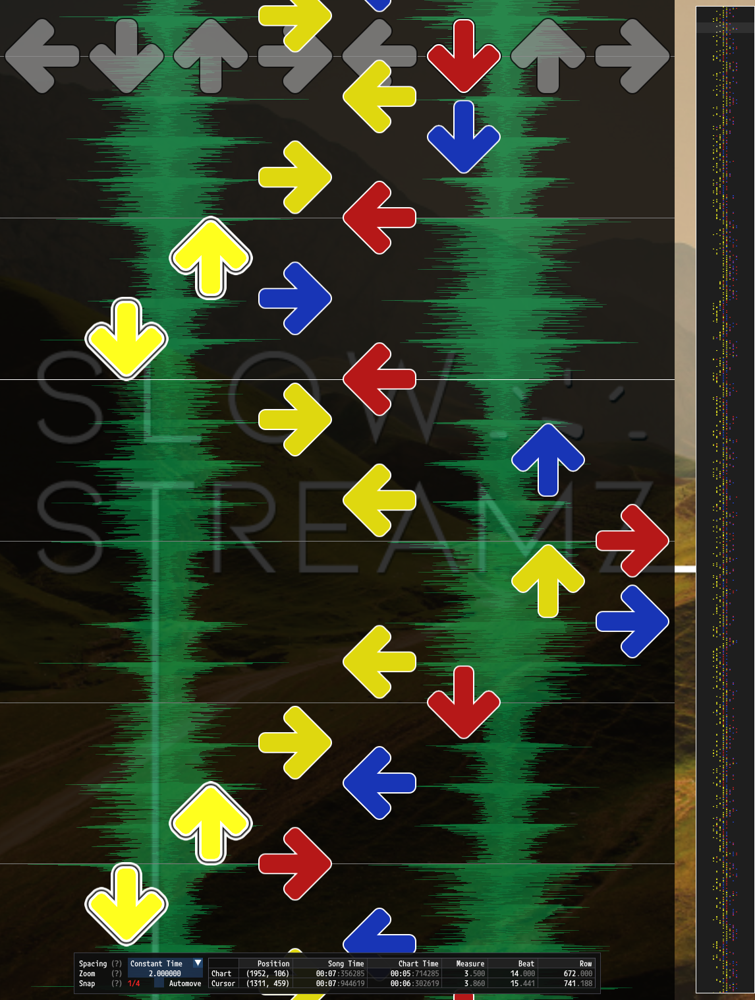
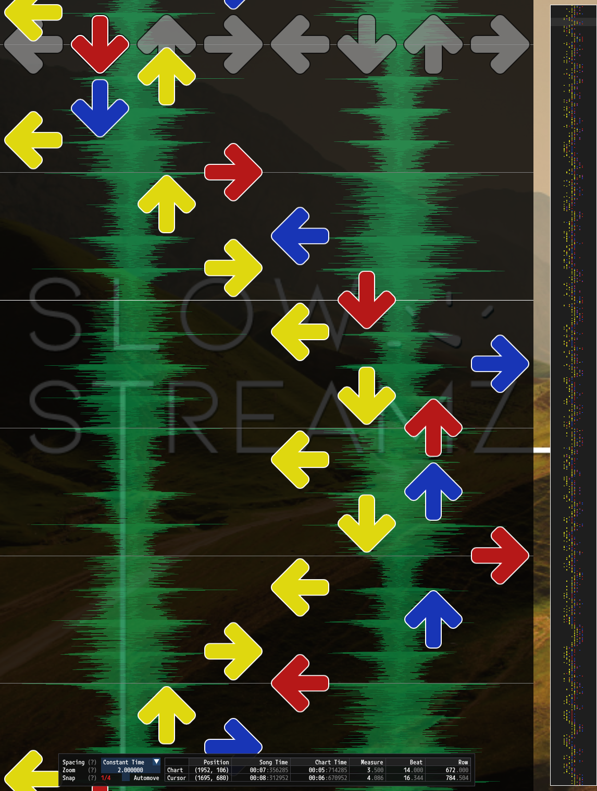

# Step Tightening Controls

Step tightening controls are a part of [PerformedChart Configuration](PerformedChart.md#performedchart-configuration) that allow for limiting individual step movements. Step tightening allows for:
- [Distance Tightening](#distance-tightening)
- [Speed Tightening](#speed-tightening)
- [Stretch Tightening](#stretch-tightening)

## Example Configuration

```json
"StepTightening":
{
	// Do not modify the x dimension for distance measurements.
	"DistanceCompensationX": 0.0,
	// Subtract a half arrow from the y dimension for distance measurements.
	"DistanceCompensationY": 0.5,
	
	// Enable distance tightening.
	"DistanceTighteningEnabled": true,
	// Start limiting steps moving at 2.25 arrow lengths.
	"DistanceMin": 2.25,
	// Stop increasing costs for moves at 3 arrow lengths.
	"DistanceMax": 3.0,

	// Enable speed tightening.
	"SpeedTighteningEnabled": true,
	// Stop increasing costs at 16th notes at 170bpm.
	"SpeedMinTimeSeconds": 0.176471,
	// Start limiting at 16th notes at 125bpm.
	"SpeedMaxTimeSeconds": 0.24,

	// Enable stretch tightening.
	"StretchTighteningEnabled": true,
	// Start limiting stretch moving at 3 arrow lengths.
	"StretchDistanceMin": 3.0,
	// Stop increasing costs for stretch moves at 4 arrow lengths.
	"StretchDistanceMax": 4.0,
},
```

# Distance Compensation

Step tightening checks involve measuring distances in panel lengths that the feet move to satisfy steps. These distance measurements can be altered to account for the foot needing to move shorter distances in Y than it does in X for equally spaced arrows since the foot is significantly longer than it is wide.

## Explanation

When paths are chosen, many steps' step tightening costs are considered. It is important to make sure the distances used for these costs are representative of real movements, otherwise undesired movements may be generated as some shorter movements may cancel out a larger movement. Consider the following examples.

<table width="66%">
<tr>
<th width="50%"> Distance Tightening with 0.0 Y Compensation </th>
<th width="50%"> Distance Tightening with 0.5 Y Compensation </th>
</tr>
<tr>
<td>

[](y-compensation-none.png)

</td>
<td>

[](y-compensation.png)

</td>

</tr>
</table>

In these examples costs are assigned based on distances for all steps. Costs scale linearly with the distance. The pattern on the left uses no Y compensation and it generated candle patterns on the left foot. These steps move a length of two arrows, yet patterns could have been generated using steps all under two arrows in length. However because the relative cost of moving between the middles (a distance of one) is so much less than the candle, patterns can be found with a lower *total* cost by applying more middle steps (while still satisfying all other rules) that end up compensating for the candles.

In the pattern on the right with 0.5 Y compensation no candles were generated and each individual step has a shorter distance, which is the intended result of individual step tightening rules. The Y compensation more accurately captures the required foot movement, resulting in a smaller difference between steps like candles and moving between the middles.

## Configuration

### `DistanceCompensationX`

Number (double) type. Distance in panel lengths to subtract from the X dimension when performing distance calculations for individual step tightening checks.

### `DistanceCompensationY`

Number (double) type. Distance in panel lengths to subtract from the Y dimension when performing distance calculations for individual step tightening checks.

# Distance Tightening

<table width="66%">
<tr>
<th width="50%"> Without Distance or Speed Tightening </th>
<th width="50%"> With Distance Tightening </th>
</tr>
<tr>
<td>

[](no-distance-or-speed-tightening.png)

</td>
<td>

[](distance-tightening.png)

</td>

</tr>
</table>

*Example conversion of a dance-single chart to a dance-double chart without distance tightening and with distance tightening. Note that both the slow and fast sections are tightened.*

Distance tightening limits individual step movements which move large distances, regardless of speed. Distance limits are defined as a range, over which costs increase.

## Configuration

### `DistanceTighteningEnabled`

Boolean type. Whether or not the distance tightening rules should be used.

### `DistanceMin`

Number (double) type. Start of the distance range for applying costs to individual steps. Any step with a distance greater than this value will receive a non-zero distance cost.

### `DistanceMax`

Number (double) type. End of the distance range for applying costs to individual steps. Steps with distances over this value will still receive non-zero distance costs.

# Speed Tightening

<table width="66%">
<tr>
<th width="50%"> Without Distance or Speed Tightening </th>
<th width="50%"> With Speed Tightening </th>
</tr>
<tr>
<td>

[](no-distance-or-speed-tightening.png)

</td>
<td>

[](speed-tightening.png)

</td>

</tr>
</table>

*Example conversion of a dance-single chart to a dance-double chart without speed tightening and with speed tightening. Note that only the fast sections are tightened.*

Speed tightening limits individual steps which move quickly. Speed limits are defined as a range, over which costs increase. Speeds are defined in arrow lengths per second. As an example, to penalize steps starting at 16th notes at 125bpm and peaking at 16th notes at 170bpm set `SpeedMaxTimeSeconds` to `0.24` and `SpeedMinTimeSeconds` to `0.176471`.

```
(60 seconds per minute / (4 notes per beat x 125 beats per minute)) x 2 feet) = 0.24 seconds
(60 seconds per minute / (4 notes per beat x 170 beats per minute)) x 2 feet) = 0.176471 seconds
```

## Configuration

### `SpeedTighteningEnabled`

Boolean type. Whether or not the speed tightening rules should be used.

### `SpeedMinTimeSeconds`

Number (double) type. Start of the distance range for applying costs to individual steps. Any step with a distance greater than this value will receive a non-zero distance cost.

### `SpeedMaxTimeSeconds`

Number (double) type. End of the distance range for applying costs to individual steps. Steps with distances over this value will still receive non-zero distance costs.

# Stretch Tightening

<table width="66%">
<tr>
<th width="50%"> Without Stretch Tightening </th>
<th width="50%"> With Stretch Tightening </th>
</tr>
<tr>
<td>

[](stretch-tightening-none.png)

</td>
<td>

[](stretch-tightening.png)

</td>

</tr>
</table>

*Example conversions from a dance-double chart to new dance-double charts without stretch tightening and with stretch tightening.*

Stretch tightening limits stretch movements to prefer tighter stretch patterns. Stretch distances measure the distance between the left foot and the right foot, rather than the distance an individual foot moves. Stretch tightening is only useful when converting from a source chart that has stretch steps. Stretch distance limits are defined as a range, over which costs increase.

## Configuration

### `StretchTighteningEnabled`

Boolean type. Whether or not the stretch tightening rules should be used.

### `StretchDistanceMin`

Number (double) type. Start of the distance range for applying stretch costs to individual steps. Any step with a stretch distance greater than this value will receive a non-zero stretch cost.

### `StretchDistanceMax`

Number (double) type. End of the distance range for applying stretch costs to individual steps. Steps with stretch distances over this value will still receive non-zero stretch costs.