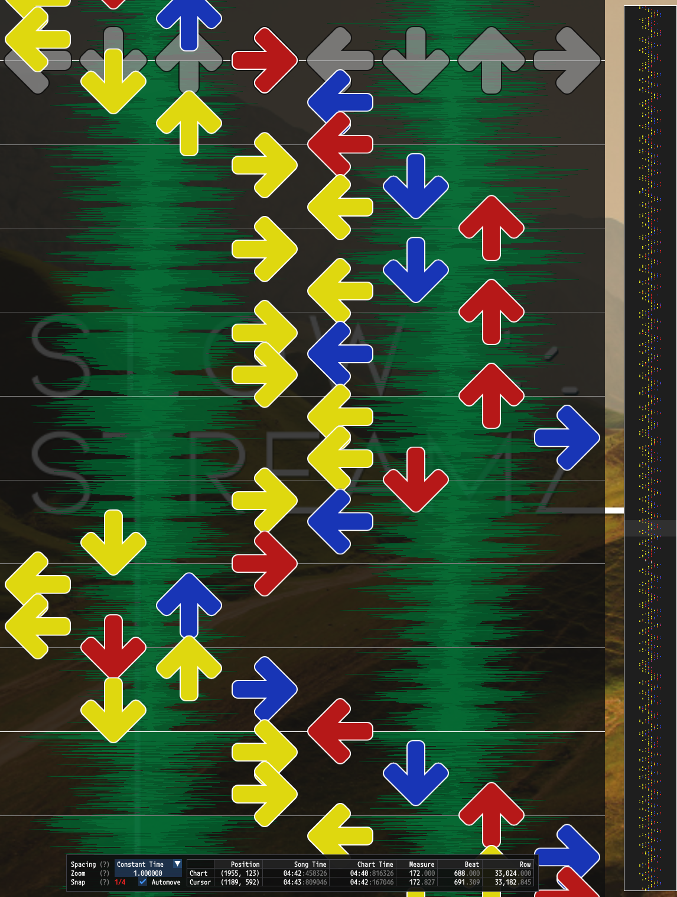
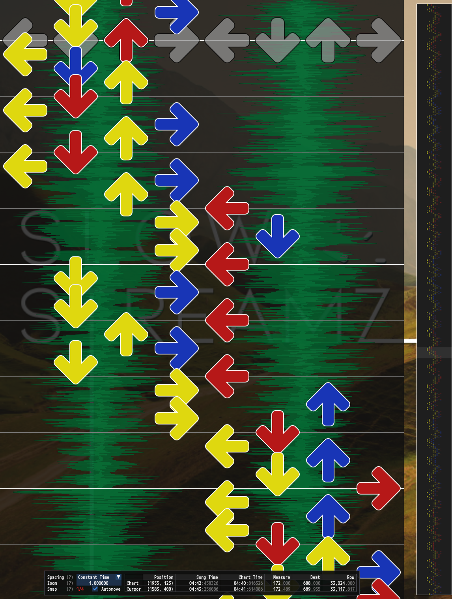

# Transition Controls

Transition controls are a part of [PerformedChart Configuration](PerformedChart.md#performedchart-configuration) that allow for controlling how often pad transitions should occur.

<table>
<tr>
<th width="25%"> No Limit </th>
<th width="25%"> 16 Steps </th>
<th width="25%"> 32 Steps </th>
<th width="25%"> 64 Steps </th>
</tr>
<tr>
<td>

[](transition-limit-none.png)

</td>
<td>

[](transition-limit-16.png)

</td>

<td>

[](transition-limit-32.png)

</td>

<td>

[](transition-limit-64.png)

</td>

</tr>
</table>

*Example transition limits in a stamina chart that allows candles.* 

## Example Configuration

```json
"Transitions":
{
	// Enable transition limits.
	"Enabled": true,
	// Prefer steps which do not transition more than once every two measures.
	"StepsPerTransitionMin": 32,
	// Do not penalize slow transitions.
	"StepsPerTransitionMax": 1024,
	// Don't limit transitions for narrow ChartTypes.
	"MinimumPadWidth": 5,
	// Consider a transition to be moving from one half of the pads to the other half.
	"TransitionCutoffPercentage": 0.5,
}
```

## Controls

### `Enabled`

Boolean type. Whether or not the transition control rules should be used.

### `StepsPerTransitionMin`

Number (integer) type. The minimum number of steps that should occur before between transitions. Higher values result in less frequent transitions.

### `StepsPerTransitionMax`

Number (integer) type. The maximum number of steps that should occur before between transitions. Lower values will prevent longer sections with no transitions.

### `MinimumPadWidth`

Number (integer) type. The minimum width of the pads for applying the transition control rules. This can be used for preventing application for [ChartTypes](ChartType.md) that aren't wide enough for transitions.

### `TransitionCutoffPercentage`

Number (double) type. Cutoff percentage to use for determining how far to the side of the pads both feet need to be in order to be considered a transition. For example `0.5` means both feed must move to one half of the pads.

## `dance-double` Cutoff Example

```
No transition moving right to left.                Transition moving right to left.
                        | 1/2 cutoff                                       | 1/2 cutoff            
         _______        |        _______                    _______        |        _______        
        |       |       |       |       |                  |       |       |       |       |       
        |   L   |       |       |       |                  |   L   |       |       |       |       
 _______|_______|_______|_______|_______|_______    _______|_______|_______|_______|_______|_______
|       |       |       |       |       |       |  |       |       |       |       |       |       |
|       |       |       |   R   |       |       |  |       |       |   R   |       |       |       |
|_______|_______|_______|_______|_______|_______|  |_______|_______|_______|_______|_______|_______|
        |       |       |       |       |                  |       |       |       |       |       
        |       |       |       |       |                  |       |       |       |       |       
        |_______|       |       |_______|                  |_______|       |       |_______|       
                        |                                                  |                       
```
